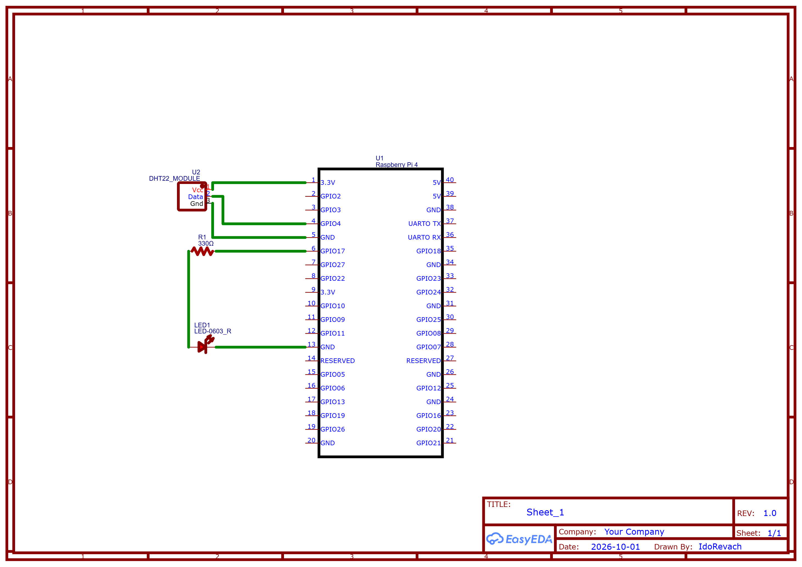

# Smart Server Environment Monitor

I leave a local server running my backend projects 24/7, and I want a physical dashboard to monitor its physical environment. 

I'll use a Raspberry Pi 4, a DHT22 sensor, and some LEDs inside a custom case. The Pi will run a web server so I can check the stats, and the LEDs will alert me if the area around the hardware gets too warm.

## System Architecture

The system reads temperature and humidity data from the DHT22 sensor, processes it on the Raspberry Pi 4, and triggers the warning LEDs if thresholds are exceeded. Below is the initial design concept:

## Why a Raspberry Pi 4?

I know an ESP32 or Arduino could just read a sensor and turn on a light. The problem is that reading the live temperature is not enough here. I want to save the data history to see if the server area is getting hotter over time.

That is why I am going with the Pi 4. It works like an actual server. I can run Node.js and a SQLite database right on the board to keep months of records. Small microcontrollers do not handle databases and web dashboards very well. Also, having a real Linux system means I can easily add Discord or WhatsApp alerts later without dealing with annoying C++ network code.

## Hardware List

The core components for this build are:

* Raspberry Pi 4 Model B
* DHT22 Temperature and Humidity Sensor
* Red Warning LED
* Basic wiring parts (jumper wires and a resistor)

### Wiring Schematic

The schematic below outlines the GPIO connections for the components. The DHT22 requires 3.3V power, and the status LED is connected with a 330Ω resistor to prevent overdrawing current from the Pi.

