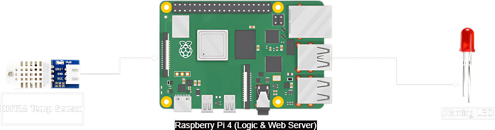
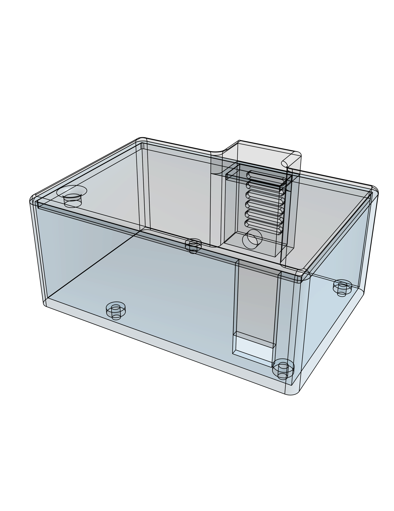
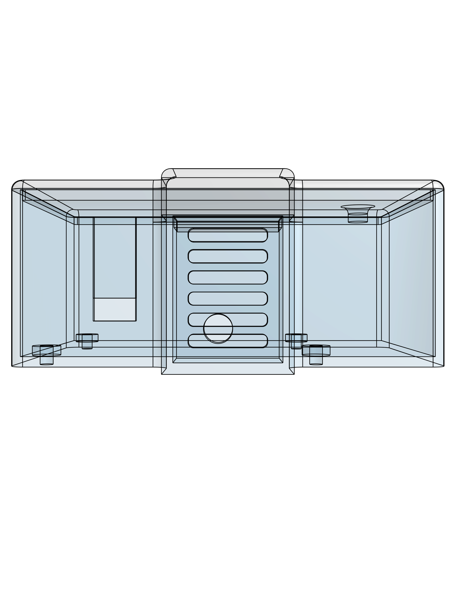
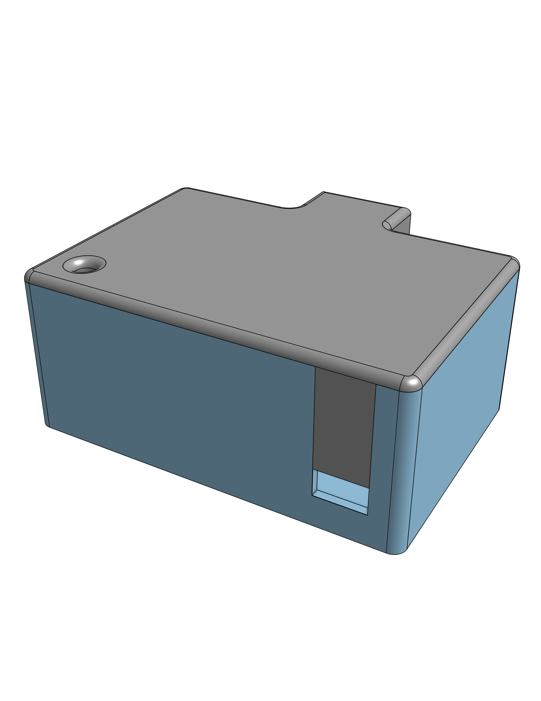
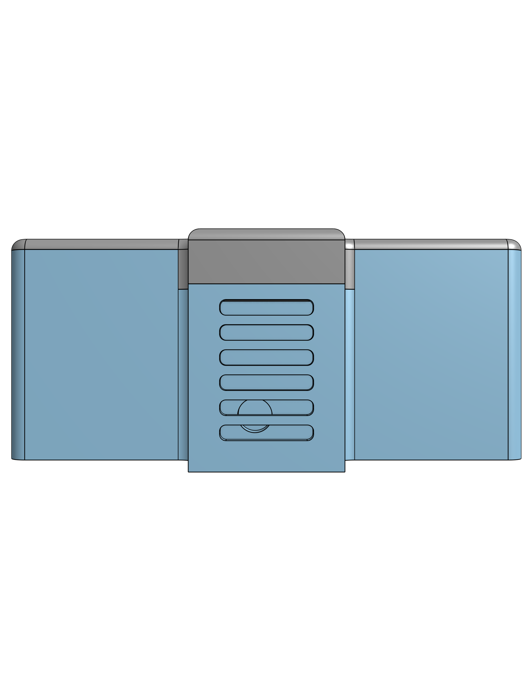

# Smart Server Environment Monitor

I leave a local server running my backend projects 24/7, and I want a physical dashboard to monitor its physical environment. 

I'll use a Raspberry Pi 4, a DHT22 sensor, and some LEDs inside a custom case. The Pi will run a web server so I can check the stats, and the LEDs will alert me if the area around the hardware gets too warm.

## System Architecture

The system reads temperature and humidity data from the DHT22 sensor, processes it on the Raspberry Pi 4, and triggers the warning LEDs if thresholds are exceeded. Below is the initial design concept:

## Why a Raspberry Pi 4?

I know an ESP32 or Arduino could just read a sensor and turn on a light. The problem is that reading the live temperature is not enough here. I want to save the data history to see if the server area is getting hotter over time.

That is why I am going with the Pi 4. It works like an actual server. I can run Node.js and a SQLite database right on the board to keep months of records. Small microcontrollers do not handle databases and web dashboards very well. Also, having a real Linux system means I can easily add Discord or WhatsApp alerts later without dealing with annoying C++ network code.

## Hardware List

The core components for this build are:

* Raspberry Pi 4 Model B
* DHT22 Temperature and Humidity Sensor
* Red Warning LED
* Basic wiring parts (jumper wires and a resistor)

### Wiring Schematic

The schematic below outlines the GPIO connections for the components. The DHT22 requires 3.3V power, and the status LED is connected with a 330Ω resistor to prevent overdrawing current from the Pi.

### Software Stack

The backend is written in Node.js, running as a background service on the Pi. I wanted a lightweight stack that can poll the sensor, log the data, and serve a simple dashboard without eating up system resources.

*   **Node.js Server:** Handles the main polling loop for the DHT22 and runs the API endpoints.
*   **SQLite:** Used for local data logging. It's perfectly suited for this because it stores everything in a single local file, avoiding the overhead of a full database server while still letting me query historical temperature trends.
*   **GPIO Control:** The backend parses the sensor data and pulls GPIO17 HIGH to trigger the warning LED if the temperature crosses a defined threshold.
*   **Frontend Dashboard:** A basic HTML/JS page that fetches the latest stats from the Node API to display current temperature, humidity, and the LED warning status.

## Enclosure & 3D Design

I'm currently applying for a hardware grant through Hack Club's Half Life program, so I don't have the Raspberry Pi 4 or the sensors yet. To make sure the project is ready when the parts arrive, I designed a custom enclosure in Onshape.

Leaving a bare board and breadboard sitting on my server isn't ideal. Also, since Pi 4s are known to run hot, I had to make sure the board's heat wouldn't affect the DHT22 readings. The case design includes ventilation slots to isolate the sensor and allow for proper airflow.

The 3D renders and STL files are available below:

* [Base STL Model](stl/SentinelNode_RPi4_Base_v1.stl)
* [Lid STL Model](stl/SentinelNode_RPi4_Lid_v1.stl)
